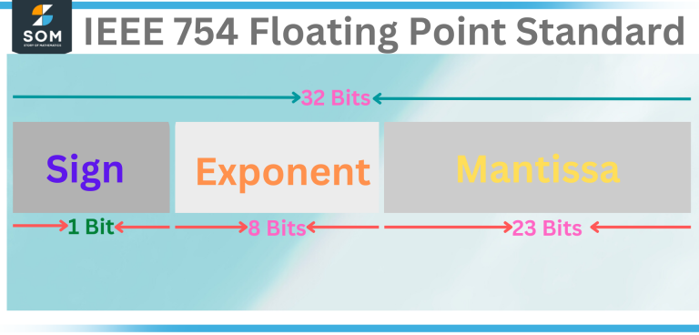

# floating_points_in_ISAs

[to_add]    
Turns out floating points in embedded systems are a luxury, and they don't come easy.  
But before we discuss anything else about "why this chapter even exists", we need to understand floating point precisions

#### What are floating point precisions? 

N*, read [this](https://www.storyofmathematics.com/glossary/mantissa/). It is vital to understand floating point vocabulary.  
Or try to follow through [this video ](https://www.youtube.com/watch?v=ILKjj30pb9E)  

**Mantissa**    
Mantissa refers to the fractional part of a number in its decimal equivalent form. For example, the mantissa of the number 3.75 is 75. For numbers written in scientific notation, mantissa is the number which occurs before the 10^m part. For example, in 2.34×10^4, the mantissa is 2.34.   

**Exponent** == power

Single-precision and double-precision are two common precisions used in floating-point representation, and they differ in terms of the number of bits allocated to represent the significant digits and the exponent.  

It is assumed that the number is represented in its scietific notation. For example, in 2.34×10^4.    
Single Precision :  {1 Sign bit}{8 Exponent bits}{23 mantissa bits}   === Total = 32 bits   
Double Precision :  {1 Sign bit}{11 Exponent bits}{52 mantissa bits}   === Total = 64 bits  

There are other kind of precisions, for example: Half precision, extended precision, custom precisions...

## Why this Chapter Exists

As earlier said, Floating point operations are a luxury in the embedded realm.  
1. Double Point precision Floats are too big in terms of memory(64 bits), so people use Single Point Precision floats(32 bits)
2. Arithmetic Logic Unit cannot directly handle Floating Point Operations. A single floating operation results to multiple arithmetic operations. So there is thing thing called a Floating Point Unit (FPU). An FPU is a special hardware/software that is dedicated for Floating point operations. An FPU is faster and more resource-efficient than an ALU when it comes to executing foating point operations. So yea, You either get a Processor that has an ALU only, and suffer slow expensive float operations OR You get a processor that has ALU + FPU and get faster and less expensive floating point operations.

Base line : The FPU is extra hardware. No_FPU == time-wasting + resource-wastage

3. Increased Code Size: Implementing floating-point operations in software can significantly increase the code size of embedded applications. This is a concern in embedded systems with limited program memory (flash) as it can lead to space constraints.  
4. Precision Trade-offs: Embedded systems often require predictable and deterministic behavior. Floating-point arithmetic can introduce rounding errors and precision issues that may not be acceptable in safety-critical or real-time applications. Fixed-point arithmetic is often preferred for these scenarios.
5. Portability: Code that relies on floating-point operations may not be easily portable between different embedded systems, especially if they have varying levels of floating-point support or different architectures.``