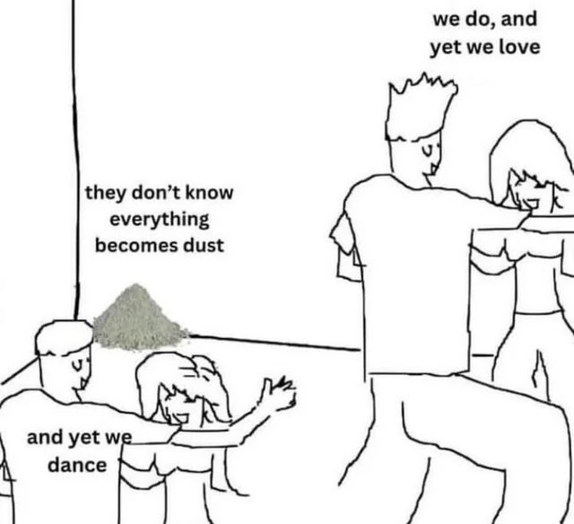

# Core Beliefs

1. Voluntary Antinatalism
2. Agnosticism
3. Computation zealotry
4. Rust zealotry
5. Riscv zealotry
6. Chilling. Just being & Doing nothing.
7. Zero-to-one.   
8. Saving humanity through engineering... this is the epitome of human engineering.  

## Reason for Journal   
Mirin Brah?!  

The main purpose of this journal is to give fellow sick c*nts a fighting chance. 

I hope you grow strong and become an exceptional engineer.  

I see life as this endless ocean; everybody drowns in the end.    
We were forced into this ocean by child_bearers.  
We have no choice but to swim or drown.  
We are too attached to life to choose suicide, so we swim and swim and swim.  
We try to give meaning to our swimming.  
Some succeed in doing so, others don't.  
Why would someone go ahead and bring another human to this ocean?   
Why give someone the burden of life?  
How is that not inconsiderate?   

Well, if I have to fight, then it's better to fight for the unborn.    
And save them from child_bearers, save them from life.  

I hope whoever reads this grows to be a strong engineer.  
Strong enough to either...  

Create an island for humanity, where they can seek refuge from the cruel ocean. A place where suffering is not a necessary part of life.(but this is very hard to implement. We have to do many zero-to-one inventions, it will be a test of our engineering capabilities)   
Or  
Give humanity a global and instant painless death, so that no-one has to ever suffer. This way, no-one ever gets to realise that people died and feel bad about it. No-one has to be a victim of child-bearing anymore.( Most Do-able option, but it affects pro-lifers negatively )   
Or  
Create a way to irreversibly euthanize all humans.(But currently, many humans think they have to have babies. They have their own personal reasons)  

So this journal is a record of me, an engineer who wants to end this suffering.  
Hopefully, whoever reads this will finish the job if I don't.  

I am currently hope-filled, we can build this utopia island with tech. A virtual world maybe, I don't know yet.  
But I acknowledge that ending things in a bang is also a solution. A solution that men who are willing to make tough choices can take.  

So the future might be a war among capable engineers; Engineers who think existence is a right and engineers who think non-existence is a right.  
Whichever side you will be, All the best brother.  

